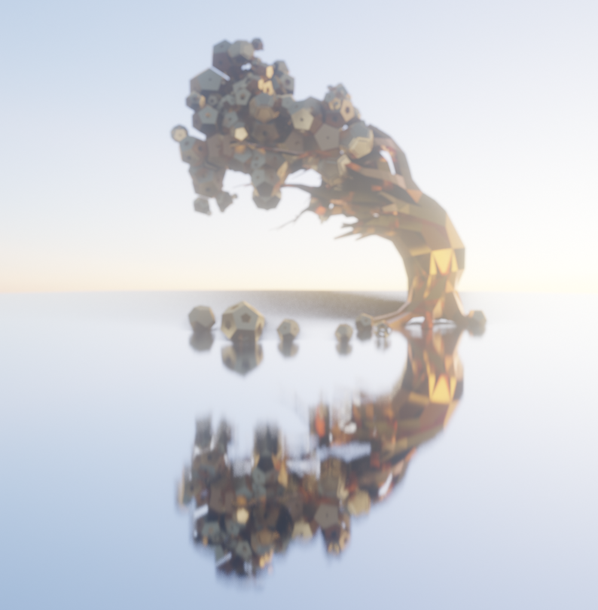
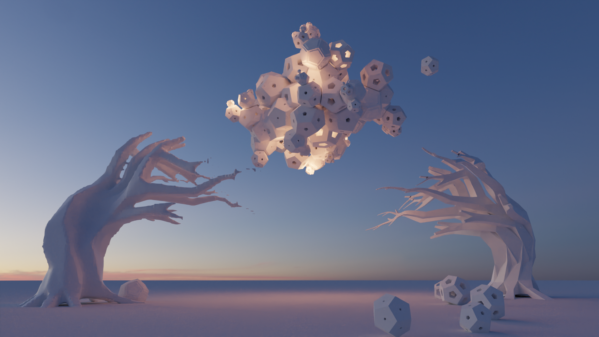
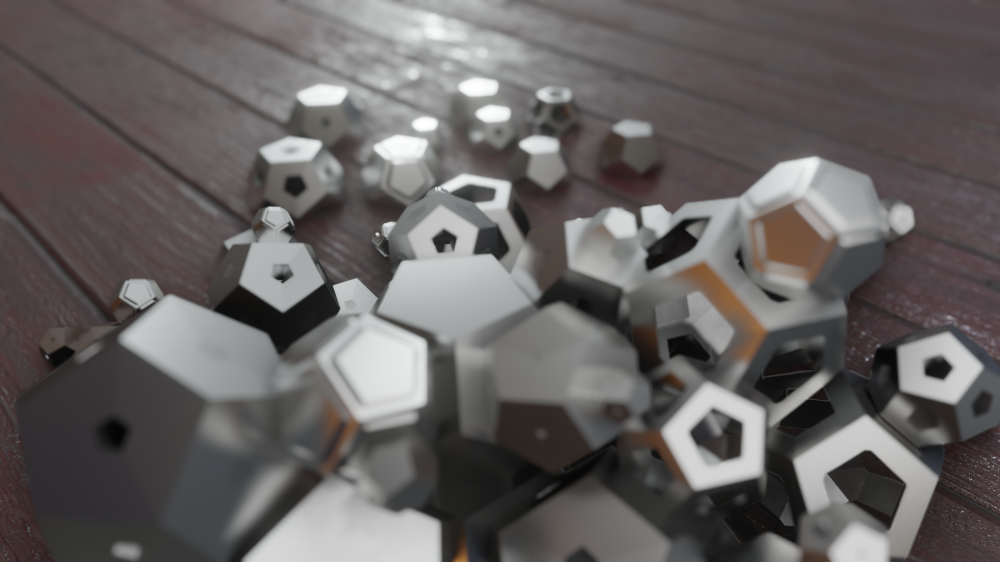
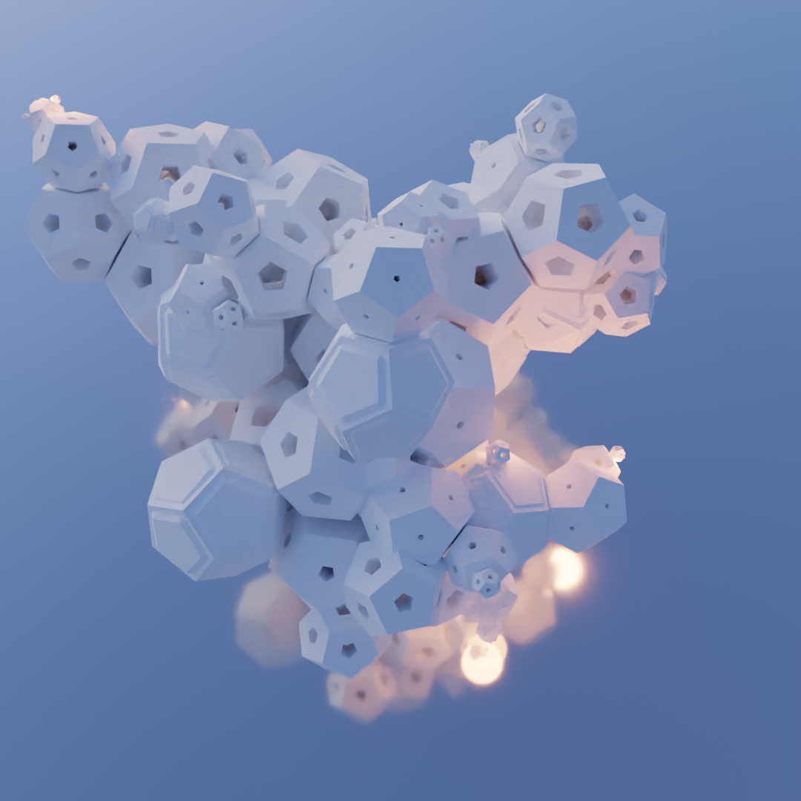
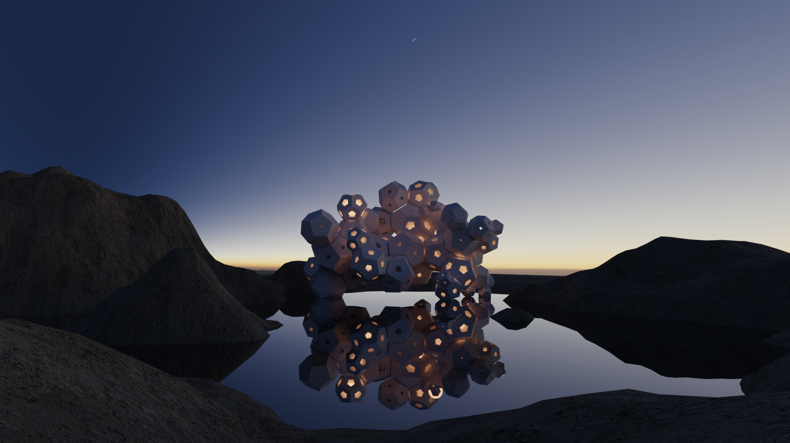
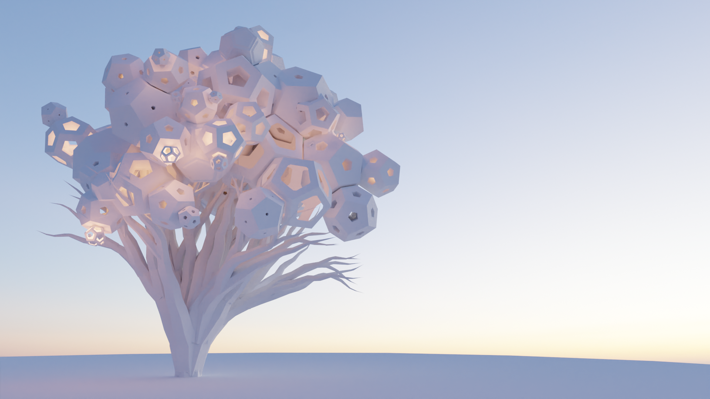

# Dodecahedron Growth

Blender Python Generative Art: Morphology of dodecahedron shapes.

Idea of this project was to create simple but interesting shape (dodecahedron), work on its variations and write rules for its growth balancing regularity and randomness aiming for aesthetics. 

# Examples

All examples are on my Art Station: https://www.artstation.com/artwork/5B5Al8

Dodecahedrons are done with the generative algorithm.

Trees and ground are done by me.

Thanks PolyHaven for fantastic HRDIs!
